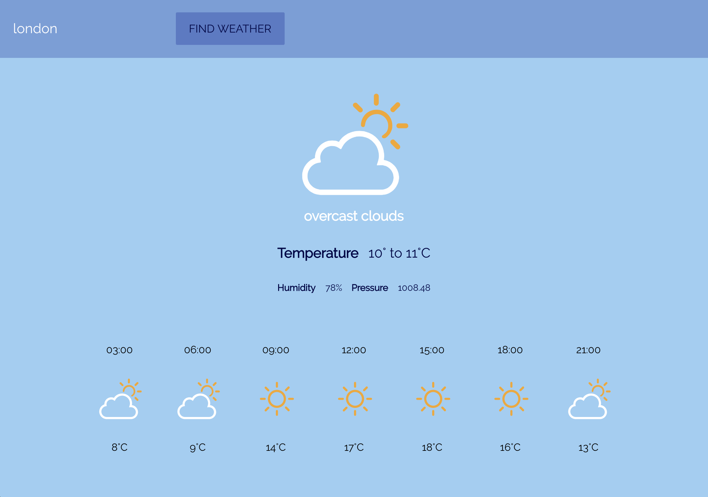

# Weather In All City In The World
To run this app on your computer you need to run this commends in your terminal:
  - `npm install` to install node-model folder
  - `npm install axios`
  - `npm start`

this project look like this bellow

